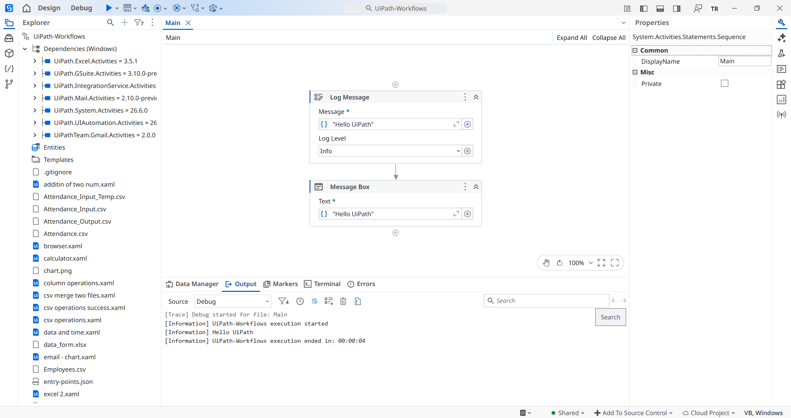
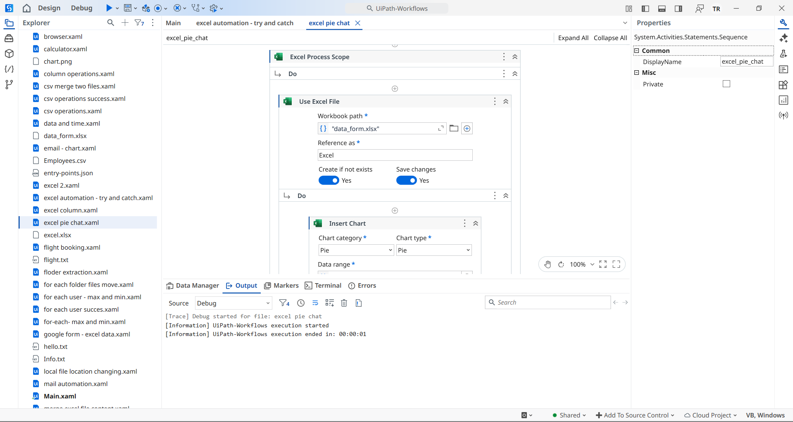
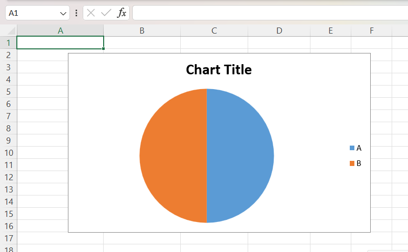

<div align="center">

# 🤖 UiPath Workflow Collection

### 🚀 A comprehensive collection of UiPath automation workflows covering Excel, CSV, Browser, Email, File System, and more.


</div>

---

# 📖 About

This repository contains a collection of **UiPath automation workflows** developed while learning and practicing **Robotic Process Automation (RPA)**.

Each workflow demonstrates a specific automation concept using UiPath Studio, ranging from beginner-level activities to more advanced workflow implementations.

The purpose of this repository is to:

- 📚 Practice UiPath development
- 🤖 Learn Robotic Process Automation (RPA)
- 💼 Build a professional automation portfolio
- 🎯 Showcase different UiPath activities and use cases
- 🔥 Provide reusable workflow examples

---

# 🖥️ UiPath Studio Interface

UiPath Studio is a powerful **Robotic Process Automation (RPA)** development environment that enables developers to automate repetitive tasks through a visual drag-and-drop workflow designer.

Unlike traditional programming, UiPath allows you to build automations by arranging activities, configuring properties, and connecting workflows with minimal code.

## 📷 UiPath Studio Overview

<p align="center">
  
</p>

### Main Components

| Component           | Description                                                                                              |
| ------------------- | -------------------------------------------------------------------------------------------------------- |
| 📂 Project Panel    | Displays all project files, workflows, and folders.                                                      |
| 🎯 Activities Panel | Contains hundreds of built-in activities such as Excel, Browser, Email, File, and Data Table operations. |
| 🏗️ Designer Panel   | The visual workspace where workflows are created using drag-and-drop activities.                         |
| ⚙️ Properties Panel | Used to configure activity properties and behavior.                                                      |
| 📝 Output Panel     | Displays execution logs, messages, warnings, and errors during workflow execution.                       |

---

## 🔄 Example Workflow

Below is an example of a UiPath workflow created using drag-and-drop activities.

<p align="center">
  
</p>

## 📊 Execution Output

After executing the workflow, the following output is generated.

<p align="center">
  
</p>

This workflow demonstrates how UiPath automates tasks by connecting activities together without requiring extensive coding.

---

# ✨ Features

✔ Excel Automation

✔ CSV Operations

✔ Browser Automation

✔ File Handling

✔ Email Automation

✔ Text File Operations

✔ ZIP & UnZIP Automation

✔ Date & Time Operations

✔ Loops & Collections

✔ Conditional Logic

✔ Exception Handling

✔ Data Manipulation

✔ Random Number Generation

✔ User Input Workflows

✔ Weather Automation

✔ Flight Search Automation

✔ Attendance Automation

✔ Payroll Processing

---


# 📂 Repository Structure

```text
UiPath-Workflows/
│
├── 📄 README.md
├── 📄 LICENSE
├── 📄 .gitignore
├── 📄 project.json
├── 📄 project.uiproj
├── 📄 entry-points.json
│
├── 📂 public/
│   ├── uipath-studio-overview.png
│   ├── workflow-example.png
│   ├── output.png
│   └── ...
│
├── 📂 Data/
│   ├── Sample Excel Files
│   ├── Sample CSV Files
│   ├── Sample Text Files
│   └── ...
│
├── 📄 *.xaml (50+ UiPath Workflows)
│
└── Additional supporting files
```

---

# 📚 Workflow Collection

This repository contains **50+ UiPath workflow (.xaml) files**, each demonstrating a specific automation concept or real-world use case.

Although the workflows are maintained within a single UiPath project, they cover a wide range of Robotic Process Automation (RPA) scenarios.

### 📊 Excel Automation

- Read and Write Excel
- Update Worksheets
- Merge Excel Files
- Generate Excel Charts
- Attendance Management
- Payroll Processing

### 📄 CSV Operations

- Read CSV Files
- Write CSV Files
- Merge Multiple CSV Files
- Process CSV Data

### 🌐 Browser Automation

- Launch Browser
- Navigate Websites
- Fill Web Forms
- Search Information
- Weather Automation
- Flight Booking Automation

### 📧 Email Automation

- Send Emails
- Email Attachments
- ZIP & Email Workflows
- Automated Notifications

### 📁 File & Folder Operations

- Copy Files
- Move Files
- Rename Files
- Folder Extraction
- File Management

### 📦 ZIP Automation

- Compress Files
- Extract ZIP Files
- Send ZIP Files via Email

### 📝 Text File Operations

- Read Text Files
- Write Text Files
- Append Data
- Modify Existing Files

### 🔄 Loops & Collections

- For Each Activities
- Nested Loops
- Collection Processing
- Maximum & Minimum Calculations

### 🛠 Utility Workflows

- Calculator
- Random Number Generator
- Date & Time Operations
- User Age Calculation
- Try Catch Examples
- Miscellaneous Practice Workflows

---

> **Note:** All workflows are independent examples created for learning and practicing UiPath Studio. Each `.xaml` file can be opened and executed individually within the project.

---

# 🛠 Technologies Used

| Technology             | Purpose              |
| ---------------------- | -------------------- |
| UiPath Studio          | Workflow Development |
| Modern Activities      | UI Automation        |
| System Activities      | Core Automation      |
| Excel Activities       | Excel Automation     |
| Mail Activities        | Email Automation     |
| CSV Activities         | CSV Processing       |
| File System Activities | File Operations      |

---

# 🚀 Getting Started

## Prerequisites

- UiPath Studio
- Windows Operating System
- .NET Desktop Runtime (recommended)

---

## Installation

Clone this repository

```bash
git clone https://github.com/tusharRaghuwanshi43/UiPath-Automation-Workflows.git
```

Open the project in **UiPath Studio**.

Restore missing dependencies if prompted.

Run any workflow (`.xaml`) individually.

---

# 📁 Sample Data

This repository includes sample files used by different workflows.

Examples:

- CSV Files
- Excel Files
- Text Files

These files are intended for learning and testing purposes only.

---

# 💡 Learning Topics Covered

- Variables
- Arguments
- Sequences
- Flowcharts
- State Machines
- If Activities
- Switch Activities
- Loops
- Try Catch
- Data Tables
- Dictionaries
- Lists
- Browser Automation
- Excel Automation
- CSV Handling
- Email Activities
- File System
- Logging
- Exception Handling

---

# 🎯 Purpose

This repository serves as:

- 📚 Learning Resource
- 💼 Portfolio Project
- 🧠 UiPath Practice Collection
- 🤖 RPA Reference Library

---

# ⭐ Future Improvements

- Add more advanced workflows
- REFramework examples
- Orchestrator integration
- API Automation
- Database Automation
- AI Center examples
- Document Understanding
- Computer Vision
- OCR Projects

---

# 🤝 Contributions

Contributions, suggestions, and improvements are always welcome.

If you have ideas for new workflows or improvements, feel free to open an Issue or submit a Pull Request.

---

# 📜 License

This project is licensed under the **MIT License**.

---

# 👨‍💻 Author

## Tushar Raghuwanshi

Computer Science Engineering Student | RPA & Automation Enthusiast | MERN Stack Developer

I'm passionate about building automation solutions using **UiPath** and developing full-stack web applications. This repository represents my journey of learning Robotic Process Automation through hands-on workflow development.

### Connect with me

- 💼 LinkedIn: https://www.linkedin.com/in/tusharraghuwanshi
- 💻 GitHub: https://github.com/tusharRaghuwanshi43
- 🧩 LeetCode: https://leetcode.com/u/tushar_raghuwanshi/
- 📧 Email: tusharraghuwanshi82@gmail.com

---

<div align="center">

## 🌟 If you found this repository useful, consider giving it a ⭐

**Happy Automating! 🤖**

Made with ❤️ using **UiPath** by **Tushar Raghuwanshi**

</div>
